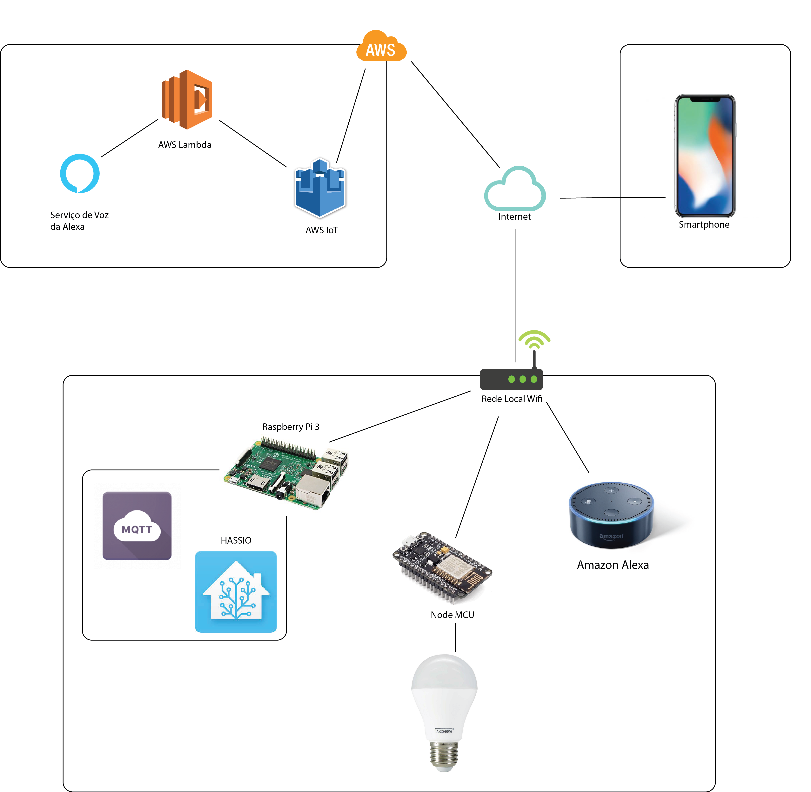
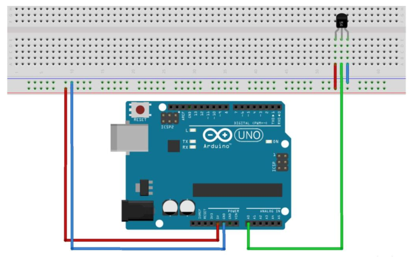

# *Munka*

## Ideia

Automação Residencial.

Será realizado uma automação residencial que será controlada através das assistentes virtuais Amazon Alexa e/ou Apple Siri.

## Diagrama de implantação

Faça um diagrama de implantação. Exemplo:

## Montagem do dispositivo

Faça um diagrama de montagem do dispositivo. Exemplo:

