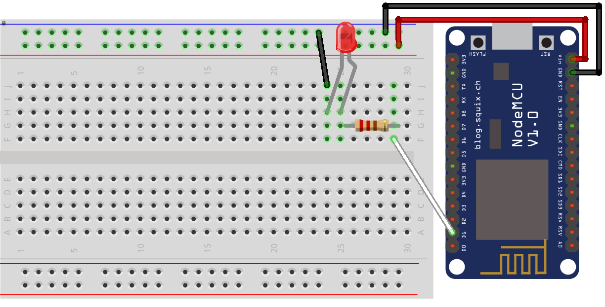

# *Nome do Projeto*

## Ideia

(*Faça uma breve descrição do problema que seu projeto irá resolver.*)

## Diagrama de implantação

Faça um diagrama de implantação. Exemplo:

## Montagem do dispositivo

Faça um diagrama de montagem do dispositivo. Exemplo:

